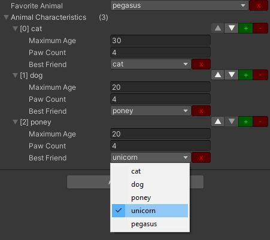
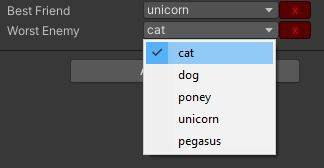
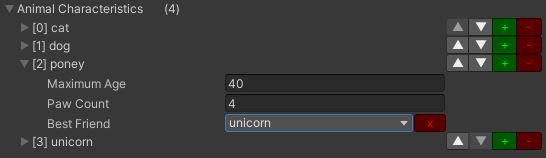

# String data list

It's a kind of dynamic enum enabler: it allows an **integer** or **string** property to have a **limited amount of values**, from a list **stored in a TXT file**.

For instance, you can have a ```List<Animal>``` with their ```maximumAge```, ```pawCount``` and ```bestFriend```, all stored as integers, but shown as below



You would have to create the ```Resources/datalist/animal.txt``` file containing this


## Description

There are two attributes and drawer:
- [Select("characters")]: allow to select a name in the list for an ```int``` or ```string``` property, the int is the index in the list.
- [DataList("season")]: allow to customise the element names of a list, it's just cosmetic.

The parameter in parenthesis is used to load a TXT file of that name from the **datalist** folder in the **Resources** of your project.
In those examples, there would be a characters.txt file and a season.txt file.

There is an **optional ```showWarning``` parameter** that is false by default. If set to true, it will display a warning if the text file matching the filename is not found or empty (see FAQ for a sample).

## Usage

### Select attribute: string or int property

1. Create a TXT file in a ```Resources/datalist``` folder in your project, named after the data your want to enter, for instance ```animal.txt```
2. Add one line per data (ie animal name)
3. Add the ```[Select]``` attribute on a string (or an int) property to be able to enter a string only from that file content as below

 ```C#
 [SerializeField]
 [Select("animal")]
 string favoriteAnimal;
  ```
  OR

  ```C#
 [SerializeField]
 [Select("animal")]
 int favoriteAnimalId;
  ```

You can even mix the two types of properties for the same data list!

```C#
[System.Serializable]
class Animal
{
  public int maximumAge = 100;
  public int pawCount = 3;
  [Select("animal")]
  public int bestFriend;
  [Select("animal")]
  public string worstEnemy;
}
```



**Caution**: if you use an int field, the value will still be the same integer even if you change the lines TXT file! (order of lines and/or content)

### List element customisation: DataList

1. Create a TXT file in a ```Resources/datalist``` folder in your project, named after the names kind your want, for instance ```animal.txt```
2. Add one line per data (ie animal name)
3. Create a child class from the generic  ```DataList<T>``` provided class (```DataList<Animal>``` in the example below)
3. Add the ```[DataList]``` attribute to a list or array property on another MonoBehaviour or ScriptableObject class

  ```C#
  [System.Serializable]
  class AnimalList : DataList<Animal> { }

  [SerializeField]
  [DataList("animal")]
  AnimalList animalCharacteristics;
  ```



**Caution**: the order of the names in the list matches the order of the animal.txt file: if you change the file, the order will also be changed in the editor.

## Demo

A demo is present under the Sample folder.

1. Load the scene
2. Select the only game object
3. In the inspector, select your favorite animal from the list, and add and/or remove characteristics.

## FAQ

### I have added ```[Select("MyCoolList")]``` before a string/int property but it still shows only a regular field, what is wrong?

Ensure the ```MyCoolList.txt``` asset exists in a ```Resources/datalist``` folder or your project and the file is not empty. If no file is found or the file is empty, this asset uses the regular property field.

If you want to make sure the attribute is correctly used, you can add a second parameter that displays a warning if something is missing:

 ```C#
 [SerializeField]
 [Select("MyCoolList", true)]
 string coolStuff;
  ```


### It still does not display the SelectDrawer/DataListDrawer!

Are you sure the inspector is not in Debug mode?

By the way, did you know that in Debug mode, you can **Alt-Click** on a property name to display the real exact property name?


